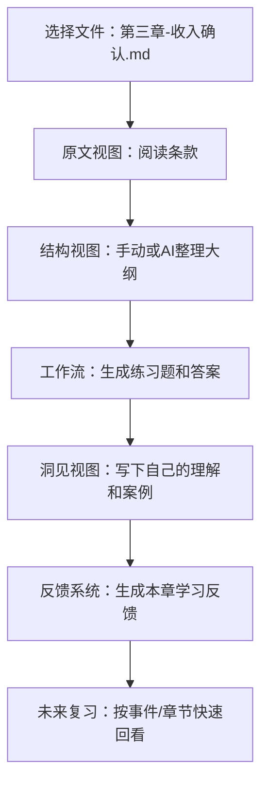

## 多模阅读器是什么

多模阅读器主要对md格式的文件做了快速一次性查看多个文件、复制多个文件，视图名可以当作ai名。


多模阅读器不只是一个“看文件的工具”，而是一个把“文件、多视图、AI、工作流、反馈”串起来的本地知识工作台。它的设计出发点是：日常学习、读书、写作、代码或财务分析时，大量的信息其实可以被拆成多个视角和多个角色，而 AI 适合作为这些视角和角色的自动化执行者，而不是一个孤立的聊天窗口。

多模阅读器是一个基于文件系统的、多视图驱动的 AI 工作流平台，它把你的本地文件、提示词、工作流、事件、反馈和外部 AI 服务（OpenAI、DeepSeek 等）组织成一个可观察、可复用、可持续改进的个人知识基建。

## 适合用来做什么

如果你正在做下面这些事情，这个项目会非常贴合：

- 深度阅读和笔记：左侧读原文，中间做结构化笔记，右侧用 AI 总结、拆解、出题或翻译；所有内容都是普通的本地文件，可长期维护。
- 知识内化和练习：通过工作流定义“读一段 → 提取关键点 → 生成练习题 → 根据答案给反馈”，并让事件系统一键批量跑完。
- 代码或文档审阅：把同一个文件拆成“原文视图 / TODO 视图 / 设计视图 / AI 建议视图”，让不同视图扮演不同角色，再用 OpenAI 或 DeepSeek 协助审阅。
- 财务或结构化分析：一边放原始凭证或报表，一边放你的分析表格或结论，再用 AI 视图生成文字解释和复盘；借助反馈系统不断迭代自己的分析模板。
- 为外部 AI 工具提供上下文：通过 `/api/views/context` 把当前所有视图内容打包成一个“动态上下文”，供你在其他脚本、工具或模型中使用。

如果你只是偶尔“看个 txt”，这个项目可能有点“杀鸡用牛刀”；但如果你在为自己的学习或工作搭一套长期可演化的“第二大脑”，这里的设计会更有价值。

## 快速上手：5 分钟体验路线

1. 准备环境并启动。
2. 打开一本你正在学的书（或一份重要文档）。
3. 观察多视图：原文视图、衍生视图、AI 视图各自承担什么角色。
4. 选一个提示词，试一次 OpenAI 调用或 DeepSeek 发送。
5. 定义一个最简单的工作流或事件，执行一次，并看看它留下了哪些文件和反馈。

下面是具体步骤。

### 安装依赖

```bash
npm install
```

### 启动应用

**Windows 图形方式：**

```bash
启动阅读器.bat
```

**命令行：**

```bash
node server.js
```

启动后浏览器会自动打开 `http://localhost:2333`，也可以手动访问这个地址。项目内置了局域网访问和内网穿透相关脚本，如果你希望在手机或其他设备上访问，可以参考 `README-内网穿透.md`。

## 系统整体观：从“文件”到“工作流”

从代码结构和运行时行为看，这个系统可以被拆成几层来理解：

- 文件系统层：`server.js` 提供文件浏览、读取、保存、新建、软删除和恢复等 API，对应你磁盘上的真实目录和文件。
- 视图层：`js/core/state.js`、`js/modules/viewManager.js` 和 `js/modules/editor.js` 负责把“一个物理文件”拆成多个逻辑视图，每个视图有独立的标题模板、后缀、滚动位置和内容。
- AI 层：`js/modules/aiService.js` 负责 OpenAI 等兼容接口的调用，`js/modules/deepseekSender.js` 加上 `server.js` 里的 Puppeteer 集成负责 DeepSeek 网页版自动化。
- 工作流与事件层：`js/modules/workflowManager.js`、`workflowVisualizer.js`、`eventManager.js`、`events/` 和 `workflows/` 目录一起构成“文件 + 视图 + AI 调用”的编排系统。
- 反馈与分析层：`js/modules/feedbackManager.js` 负责把工作流或节点执行结果转成“反馈文件”，并通过 `fankui_log` 和 `js/modules/usage/*` 中的模块做关键字统计与使用分析。
- 配置与个性化层：`themes/`、`layouts/`、`prompts/` 和对应的后端 API 提供主题、布局、提示词和视图配置的持久化与历史记录。

从使用者的角度，你可以把它理解成：你在文件系统上走路，视图系统帮你戴上不同眼镜看同一个文件，工作流与事件系统帮你把复杂的“学习或分析过程”拆成可执行的步骤，AI 层则是每一步背后真正干活的角色，而反馈系统则在默默记录并帮你复盘。

## 核心概念和设计取向

### 一切以文件为中心

这个项目刻意没有引入数据库，而是把几乎所有信息都落在文件系统中：

- 原始内容、AI 结果、工作流步骤输出、反馈报告，都是真实的 `.md` 或 `.txt` 文件。
- 软删除通过在磁盘上加 `.deleted` 后缀实现，`server.js` 会扫描项目和父目录下的 `.deleted` 文件，和 `trash.json` 同步，提供回收站 API。
- 工作流执行的每一步、事件的结果、AI 的输出都通过命名约定落在特定目录中，方便你用任何编辑器或脚本再次处理。

这意味着：就算你完全不用前端界面，只是用 VS Code 或其他工具看这些文件，它仍然是有结构、有语义的。

### 多视图就是多角色

在 `editor.js` 中，每个视图都有：

- 一个 `id`（例如 `original`、`outline` 等）。
- 一个 `titleTemplate`，通常包含 `{filename}`。
- 一个 `suffix`，决定对应的派生文件名。

对于同一个物理文件 `foo.md`：

- 无后缀的视图通常直接对应 `foo.md`。
- 带后缀的视图会对应 `foo{suffix}.md`，并存放在以文件名为名的子目录中。
- AI 结果文件采用类似 `foo_{viewId}_AI.md` 的命名，并统一放在文件名子目录下。

这样设计的好处是：你可以让不同视图扮演不同的认知角色，例如：

- 原文视图：放原始材料。
- 结构视图：放大纲或结构化笔记。
- 问答视图：放练习题或自测。
- 洞见视图：放自己的总结与决策。

而这些角色之间的关系，不再是抽象存在，而是实打实的文件和路径。

### AI 是流水线的一部分，而不是一个单独的对话框

这个项目里有两类 AI 集成：

- 面向 API 的 OpenAI 系列：在 `aiService.js` 中，每个视图都有自己的 `openaiConfig`，包括 `apiKey`、`apiUrl`、`model` 等。`callOpenAIWithContext` 和 `streamOpenAIWithContext` 会自动收集所有视图内容、加上全局提示词，作为上下文拼接到用户消息前，再以流式或非流式方式调用。
- 面向网页的 DeepSeek 自动化：在 `server.js` 中，使用 Puppeteer 打开 `https://chat.deepseek.com`，复用本地的 `deepseek-profile` 目录保存登录状态。前端的 `deepseekSender.js` 则负责把“所有视图内容”或者“单个视图内容加对应提示词”封装成一段文本，通过 `/api/deepseek/send` 丢给 DeepSeek。

两者的共同特点是：都把“当前视图的上下文”拼得很完整，把提示词管理和视图角色管理当成一等公民，而不是随手临时复制粘贴几段文字。

### 工作流与事件：把“习惯”写成可执行配置

`workflows/` 里存的是工作流定义（Markdown 格式加 JSON 配置），`events/` 里是事件定义。典型模式是：

- 一个工作流描述一个相对通用的“处理过程”，例如“读一段 → 提取关键点 → 生成练习题 → 做自测 → 输出学习笔记”。
- 一个事件则把某个具体文件或项目路径挂到某个工作流上，并可以指定视图、执行模式（并发或顺序）等。

事件触发时会：

- 按顺序或并发执行工作流中的各个步骤。
- 每个步骤通过 `editor.js` 的写入函数，把 AI 结果落地成带时间戳、视图信息的文件。
- `log` 目录记录执行日志，配合 `usage` 模块可以做后续统计和回溯。

这套机制的意义在于：你的学习或分析套路变成了可视、可执行、可分享的工件，而不是散落在脑海里的模糊经验。

### 反馈系统：把 AI 和人的表现转成“可检索的经验库”

`feedbackManager.js` 和 `fankui_log/` 目录，是这个项目的一个亮点。

- 对于工作流整体，它会读取各步骤结果，套用你配置好的“工作流反馈提示词”，调用 AI 生成一份整体反馈，按年月日和工作流名归档为反馈文件。
- 对于单个节点或视图，它会根据为该视图配置的“节点反馈提示词”，读取某个步骤的 AI 回复与发送内容，再生成对这个节点表现的反馈，按事件维度归档。
- 它还提供“最近反馈读取”“时间范围过滤”“按事件查看”等接口，并能用 `usage/keywordStats.js` 把反馈做关键字统计，支持你后续做更高阶的使用分析。

更贴近界面的使用说明（包括反馈列表、反馈编辑器、反馈配置、关键字识别规则管理和“全部关键字统计”弹窗），可以参考项目根目录下的 `反馈系统与关键字识别界面说明.txt`。如果你暂时不希望生成新的反馈文件，可以在“反馈配置”面板中通过“启用 AI 反馈生成”复选框一键关闭整个反馈系统的自动生成功能；关闭后不会再写入新的工作流反馈或节点反馈文件，但历史反馈仍然可以浏览和统计。

结合反馈系统和关键字识别，这几个界面的一个自然用法是：

1. 在工作流/节点的反馈提示词里，明确告诉 AI：用某种括号格式标记你关心的内容（例如风险点、收获、疑问等）。  
2. 在关键字识别规则管理界面里，为这些括号格式配置清晰的“开头/结束标识”，并勾选启用。  
3. 跑一段时间工作流后，到反馈列表里按时间或事件浏览几份反馈，用全屏编辑器微调 AI 的标注习惯。  
4. 点击“全部关键字统计”，查看这些关键字在最近一段时间内的分布，并在 `fankui_log/guanjianzi` 中积累一个可被脚本进一步消费的结构化语料库。  

你不只是跑了一次工作流，而是在为自己积累一份份带评语的作业本，以后可以按事件、按工作流、按视图回看“过去的我和过去的 AI 都做了些什么”。

## 使用路线：从日常阅读到自动化流水线

### 第一步：当作多视图阅读器使用

1. 启动应用，在左侧选择一个目录，浏览文件列表。
2. 用 `W/S/Enter/E/Q` 这些快捷键在目录和文件间快速切换。
3. 打开一个 `.md` 或 `.txt` 文件，观察多个视图如何显示不同后缀文件（或者提示“Ctrl+V 创建”）。
4. 使用 `Ctrl+V` 把剪贴板内容粘到某个视图，注意它会创建或更新对应的文件，并即时渲染 Markdown（含表格、代码、高亮和 Mermaid）。

在这个阶段，它就是一个“多视角的本地 Markdown 阅读加记笔记环境”。

### 第二步：引入提示词和 OpenAI

1. 在 `prompts/` 下创建或编辑提示词，也可以通过界面管理提示词，并为某些视图绑定专属提示词。
2. 在视图配置中为某些视图填上 OpenAI 兼容接口（API Key、API URL、模型名）。
3. 使用相关按钮或脚本，让某个视图扮演“解释者”“提问者”“检查者”等角色，观察它如何自动带上所有视图内容和全局提示词。

这时你会开始体会到“多视图加提示词加上下文拼接”的好处：AI 的回答不再是孤立的，而是对整个工作状态的回应。

### 第三步：接入 DeepSeek 作为“外部大脑”

1. 启动应用时，会自动打开一个 DeepSeek 浏览器窗口；第一次需要你手动登录，之后会复用 `deepseek-profile` 里的登录态。
2. 在阅读器中按下 `M`，会把“全局提示词加所有视图内容”打包成一段文本，通过 `/api/deepseek/send` 丢给 DeepSeek。
3. 按下 `N` 或点击视图上的按钮，则会只发送单个视图的内容和提示词。

你依然在本地文件中组织和累积知识，只是偶尔把上下文打包给 DeepSeek 这样的外部专家，而不是把所有知识都托管在云端聊天记录里。

### 第四步：把常规操作抽象成工作流和事件

1. 在 `workflows/` 里定义若干工作流（可以从示例开始），用 Markdown 加配置描述每个步骤的输入、依赖和目标。
2. 在 `events/` 中配置几个常用的事件，例如“读书 · 第三章 · 精读模式”或“某个项目的代码安全体检”。
3. 在界面里选择事件，按下 `G` 触发执行，观察每个步骤对应的 AI 调用、结果文件和状态面板。
4. 打开 `log/` 和事件对应的文件名文件夹，看看它在磁盘上留下了什么足迹。

到这里，你已经把自己的学习或分析习惯写成了一套可复用的流水线。

### 第五步：引入反馈与使用分析

1. 在反馈配置界面为工作流和若干视图配置专属反馈提示词。
2. 执行事件或工作流后，让反馈系统根据你的结果生成“整体反馈”和“节点级反馈”，它们会被归档到 `fankui_log/`。
3. 使用反馈列表和筛选功能，按时间范围或事件名过滤，看看哪些模式在反复出现。
4. 借助 `usage` 模块里的统计能力，为自己的工作流和事件做简单的使用报表，比如哪些事件最常用、哪些视图产出的文件最多、哪些关键字频繁出现。

如果你走到了这一步，你不仅在用这个工具，更是在和未来的自己进行一种长期对话。

## 技术与架构细节

### 后端：`server.js` 的主要职责

- 静态资源与基础 API：
  - 目录浏览：`GET /api/directory`
  - 文件读取：`GET /api/file`
  - 文件保存与创建：`POST /api/save-file`、`POST /api/new-file`、`POST /api/new-folder`
- 软删除与回收站：
  - 基于 `.deleted` 后缀的软删除机制，`trash.json` 维护回收站元数据。
  - 提供软删除、恢复、永久删除单项或全部等接口，并通过 `isLocalAccessRequest` 保证危险操作只允许本地或内网调用。
- 主题、布局、提示词、工作流、事件管理：
  - 分别对应 `themes/`、`layouts/`、`prompts/`、`workflows/`、`events/`，提供列表、获取、保存、删除 API，并内置最多 50 条的历史版本记录。
- 上下文 API：
  - `POST /api/views/context` 接收前端拼好的“多视图上下文”和元信息。
  - `GET /api/views/context` 面向外部项目返回纯文本上下文，并在日志中记录调用者 IP 段和上下文长度等信息。
  - `GET /api/views/context/info` 返回上下文是否可用、长度和最近更新时间。
- DeepSeek 集成：
  - 使用 Puppeteer 启动浏览器并打开 `https://chat.deepseek.com`，复用 `deepseek-profile` 保存登录态。
  - 通过 `/api/deepseek/send` 在 DeepSeek 页面里模拟输入和回车发送消息。
  - 通过 `/api/deepseek/status` 提供初始化和登录状态查询。
- 日志与使用统计：
  - `POST /api/log/write`、`POST /api/log/read` 提供结构化日志写入和多条件过滤。
  - `POST /api/log/scan` 与前端使用模块配合，从文件系统反向推导工作流、事件和视图的使用情况。

### 前端：`js/` 目录中的关键模块

- `core/`：
  - `state.js` 维护全局状态（当前目录、当前文件、视图配置、提示词、工作流执行状态等）。
  - `api.js` 对后端 REST 接口做了一层封装（`getFile`、`saveFile`、`getDirectory`、`createFolder` 等）。
- `utils/`：
  - `markdownConverter.js` 负责 Markdown 转 HTML 和表格、代码等增强。
  - `fileUtils.js` 定义了“文件名文件夹”的路径规则，如 `getFileFolderPath`、`getFileInFolderPath`。
  - `history.js` 管理粘贴历史和撤销栈。
- `modules/`：
  - 文件与视图：`fileManager.js`、`fileOrganizer.js`、`viewManager.js`、`editor.js`、`tableEditor.js` 等。
  - AI 与提示词：`promptManager.js`、`chatManager.js`、`aiService.js`、`deepseekSender.js`。
  - 工作流与事件：`workflowManager.js`、`workflowVisualizer.js`、`eventManager.js`、`batchExecutor.js`。
  - 反馈与使用统计：`feedbackManager.js`、`usage/keywordStats.js`、`usage/logQuery.js` 等。

如果你准备在这个项目上继续开发，建议优先阅读 `editor.js`、`aiService.js`、`feedbackManager.js`、`workflowManager.js`，它们串起了视图、AI、工作流和反馈的主路径。

## 命名与文件组织约定

- 视图文件：
  - 原始文件：`path/to/file.md`
  - 派生视图文件：`path/to/file/` 目录下的 `file{suffix}.md`
  - AI 视图文件：`file_{viewId}_AI.md`，同样位于文件名文件夹内。
- 事件执行步骤文件：
  - 大致格式为 `timestamp_baseName_viewId_步骤N.ext`，如 `2025-12-21_08-47-34_读书_notes_步骤1.md`。
  - 存放在对应文件名文件夹中。
- 反馈文件：
  - 节点反馈：`fankui_log/YYYYMM/DD/{事件名}/{事件名}_{时间戳}_{文件名}_{视图ID}_反馈.md`。
  - 工作流反馈：`fankui_log/YYYYMM/DD/{工作流名}/{事件名}_{时间戳}_{文件名}_工作流反馈.md`。

理解这些命名和目录，你就可以轻松用任意脚本语言批量分析自己的学习或工作数据。

## 快捷键（摘要版）

- 全局：
  - `Ctrl+C`：复制所有视图内容（带提示词）。
  - `Ctrl+V`：粘贴到当前选中的视图。
  - `Ctrl+Z`：撤销上一次粘贴。
  - `Z`：返回上一个文件。
  - `ESC`：关闭面板或退出全屏。
- 文件导航：
  - `W` / `S`：在文件列表中上下移动。
  - `Enter`：打开当前选中文件。
  - `E`：进入目录。
  - `Q`：返回上一个文件或目录。
  - `Delete`：软删除当前选中的文件或目录（移动到回收站，可恢复或永久删除）。
- 视图与 AI：
  - `A`：第一个视图表格全屏。
  - `D`：第二个视图表格全屏。
  - `J`：切换所有视图到 `_AI` 文件。
  - `K`：一键交换所有视图的原始文件和 `_AI` 文件内容（接受或回滚AI修改）。
  - `M`：发送所有视图内容到 DeepSeek。
  - `N`：发送当前视图内容到 DeepSeek。
- 事件与工作流：
  - `F`：切换事件列表。
  - `G`：执行当前选中的事件。
  - `R`：循环切换粘贴目标视图。
  - `T`：循环切换提示词。

更完整的快捷键说明请查看项目根目录下的 `快捷键.txt`。

## 部署与访问形态

- 本机使用：直接运行 `node server.js` 或双击 `启动阅读器.bat` 即可。
- 局域网与内网穿透：项目中包含如 `启动内网穿透.bat`、`局域网连接.bat` 等脚本，以及 `README-内网穿透.md` 文档，用于把本地 2333 端口暴露到局域网或互联网，方便手机和平板访问。
- 数据存放位置：所有配置和运行数据都跟随项目目录，你可以用 Git 等方式对整个项目做快照和版本管理。

## 开发者建议与可扩展方向

- 在现有工作流和事件机制之上，增加更友好的前端可视化编辑器，让工作流完全可以通过拖拽和表单配置完成。
- 把反馈系统的关键字统计接口开放出来，做一个简单的“反馈搜索”和“相似反馈推荐”，让历史经验更容易被重新发现和复用。
- 增加对更多 AI 后端的兼容（例如本地 LLM 或其他云厂商），复用现有的 `openaiConfig` 和上下文拼接逻辑。
- 为视图和工作流增加“模板库”，方便在不同项目之间复用成熟的分析套路。

你可以把现在的版本看成是一个已经能跑起来的个人 AI 工作台内核，后续无论是自己用还是分享给别人，都有很大的扩展空间。

## 典型使用场景示例

这里用“读一本专业书”当例子，你可以很容易把它类比到会计学习、技术书精读或者项目文档审阅上去。

想象你在看一本书的某一章，原文是 PDF 或网页，你已经手动复制成 `第三章-收入确认.md` 放在某个目录下。打开多模阅读器，选中这个文件后：左侧是文件树，中间和右侧是几个视图，比如原文视图、结构视图、问答视图和洞见视图。原文视图直接呈现这章内容，结构视图用大纲或表格的形式整理出关键条款，问答视图存放你设计的练习题和 AI 生成的答案，洞见视图则写下你自己的理解、风险点和案例。

接着你给“问答视图”和“洞见视图”分别绑定不同的提示词，并为它们配置不同的 OpenAI 模型。此时，一个简单的工作流就可以长这样：第一步，让 AI 根据原文生成一组选择题；第二步，请它针对你的答案给出逐题点评；第三步，总结这次学习的易错点和下一次需要回看的位置。你可以把这个过程写进 `workflows/读书.json`，再在 `events/` 里为不同章节配置多个事件，日常只需要在事件列表里用 `W/S` 选中某个事件，按一下 `G`，整套流程就会在后台帮你跑完。

这一套跑完后，对应章节的文件名文件夹里会多出若干 AI 结果文件和步骤文件，`fankui_log` 中多了一份本次工作的“整体反馈”，以后你想复习，只要翻开这些文件，就能看到“过去的我”和“过去的 AI”是怎么理解这章内容的。如果你习惯用外部脚本做进一步分析，也可以只看这些文件和日志，把阅读器当成“能够产出高结构化数据的前端工厂”。

如果你喜欢把流程画成图，完全可以用项目已经支持的 Mermaid 在任意一个视图里加上类似的流程图作为“自述文档的一部分”：



## 外部 AI 调用示例

多模阅读器内置的 `/api/views/context` 其实可以看成是“面向外部世界暴露出来的上下文快照”，它把当前所有视图内容和全局提示词拼在一起，方便你在别的工具里继续加工。

例如，你可以在一个独立的 Python 脚本里这样获取上下文，然后发给任意一个支持 Chat Completion 的模型：

```python
import requests

context = requests.get("http://localhost:2333/api/views/context").text

messages = [
    {"role": "system", "content": "你是一个严格的代码与文档审阅者。"},
    {"role": "user", "content": f"下面是多模阅读器当前所有视图的内容，请帮我指出最值得优化的三个工作流设计点，并给出具体修改建议：\n\n{context}"}
]

resp = requests.post(
    "https://api.openai.com/v1/chat/completions",
    headers={"Authorization": "Bearer YOUR_API_KEY"},
    json={"model": "gpt-4.1", "messages": messages}
)

print(resp.json()["choices"][0]["message"]["content"])
```

同样的思路也适用于任何支持 HTTP 的语言：你只需要把多模阅读器当成一个专门负责“管理本地文件、视图和工作流”的前端，把 `/api/views/context` 当成一个随时可以取用的“高质量上下文接口”，然后在外部自由选择你喜欢的模型和调用方式。

## 元信息

- 文档更新时间：2025 年
- 适配环境：Windows 10+，Node.js 16+（其他平台可以视情况调整脚本）
- 使用许可：本项目目前定位为学习和个人使用，你可以在本地自由修改、扩展和定制。

